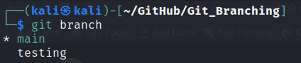

<!-- # Branching in GitHub -->

Branching in GitHub is a way to create different versions of your project's code. Imagine your project as a tree, and the main branch as its trunk. When you create a new branch, it's like growing a new branch from the trunk.

Each branch can have its own set of changes, updates, or experiments without affecting the main branch or other branches. It allows multiple people to work on different parts of the project at the same time, without interfering with each other's work.

Once you're satisfied with the changes in your branch, you can merge it back into the main branch. Merging combines the changes from your branch into the main branch, so everyone can benefit from the improvements you made.

So, moving ahead in this blog we gonna learn about how to **Create**, **Update**, **Delete** and **Merge** the branches in GitHub.

# Creating a New Branch

You can create a new branch using command `git branch` . When you create a branch, it creates a new pointer for you to move around.

For example you want to create a branch with a name `testing` :

```
$ git branch testing
```

Now, the branch is created and you can see it by using the same command :



You can see that branch is created, but it is pointing to `main` branch.

# Switching Branches

To switch to an existing branch, you can use command `git checkout` . Let’s switch to a `testing` branch which we created :


To see now on which branch you are on, use `git branch` command :


Now you can see that the `*` is pointing to the testing, which means branch is on `testing` .

## Creating and Switching with Short Hand

```
$ git checkout -b testing
```

where `-b` is branch name. This will create and switch to `testing` branch at the same time.


# Merging Branches

 Before **Merging**, A**dd** and C**ommit** your changes in that branch.

- You can merge your branch to the main branch or main branch to your branch
- To merge, first you have to `checkout` to that branch first. For example, if you want to merge `testing` branch to `main`, you have to `checkout` to main branch
- Now you can merge branch with command : `git merge [branch name]`

Here is a practical example of merging branch :


## Merging to Origin(GitHub)

All the things that we have done until now is on your local system, now to push it to origin i.e. GitHub so that it is available to other developer, we can use following command :

```
$ git push origin [branch name]
```

Here is a practical example:


Now, if you go to your GitHub page you can see that it is available there : 


# Deleting a branch

After merging your branch to main, it is a best practice to delete that branch to have a clean and clear repository on your GitHub.

Here is how you can delete a branch :

```
$ git branch -d [branch name]

or to force delete 

$ git branch -D [branch name]
```


## Deleting branch on Origin(GitHub)

Things until we were doing were on local machine, now to remove it from Origin i.e. GitHub we can use following command :

```
$ git push origin --delete [branch name]
```

Here is a practical example :


# Conclusion

In summary, branching in GitHub is a way to organize and collaborate on projects by creating separate versions of the code, allowing multiple people to work on different tasks without causing conflicts, and merging the changes back together when they're ready.

# Reference

[https://git-scm.com/book/en/v2/Git-Branching-Branches-in-a-Nutshell](https://git-scm.com/book/en/v2/Git-Branching-Branches-in-a-Nutshell)