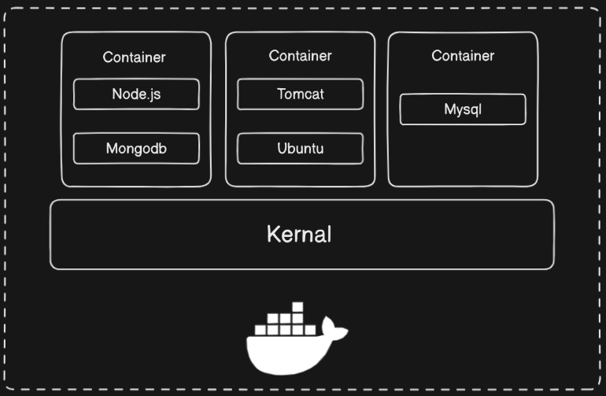

Imagine if you could put your app along with everything it needs like **code**, **libraries**, and **settings** into one simple, portable box.
No more problems like "it works on my computer but not on yours."
No more complicated setup installations.
This is exactly what Docker and containers do for developers.

Today, in the fast-moving world of software development, containers have become super important.
They help developers build, move, and run applications anywhere **easily** and **reliably**.
At the center of this container revolution is **Docker** the tool that made using containers simple, powerful, and available to everyone.

So in this blog we are going to learn what actually container is and how docker use container to sum up whole application in one.

# Why we need Containers ?

In the old days, deploying an application looked something like this:

- You write code on your local machine and push it to Git.
- Then you copy that code to a server and run it.

**But there were many problems with this approach:**

- If you developed the app on **Windows** and the server was running **Linux**, it often didn’t work properly.
- The **environments** were **different** — different operating systems, different libraries, different settings.
- Even small differences, like using **Node.js version 22** on your machine but **Node.js version 18** on the server, could cause the app to fail.

These kinds of issues made deployments unreliable, slow, and frustrating.

## The Solution: Containers

**Containers solve this problem** by wrapping everything your application needs — code, runtime, libraries, and environment settings — into **one portable unit**.

# What is Container ?



A **container** is a **lightweight**, **standalone**, and **executable** piece of software that packages everything needed to run an application — including the code, libraries, dependencies, and settings — into one neat unit.

In **Docker**, we first build an **docker image** with everything our app needs. When we want to actually run the app, we create a container from that image — and that’s where the magic happens.

**Example**:- **A React frontend app** containerized with Node.js, build tools, and static files, ready to serve users.

# Now let’s learn what is Docker Image


A **Docker image** is a **snapshot** of everything needed to run an application.

It contains:

- The application code,
- All the dependencies (libraries, frameworks),
- Configuration files, and
- Instructions for how the application should run.

✅ **Think of a Docker image like a _blueprint_ or a _template_ for creating containers.**

When you run a Docker image, you create a **container** — a live, working version of your application based on that image.

Now that we know what container is and what docker image is. Now we can dive into what docker is

# What is Docker ?

**Docker** is a **platform** (or a tool) that helps developers **build**, **ship**, and **run** applications easily by using something called **containers**.

Before Docker, developers often faced problems like:

- "It works on my machine but not on the server,"
- Complicated setup steps,
- Environment mismatches between local and production.

✅ **Docker solves this by packaging your application and everything it needs (like libraries, dependencies, settings) into a container.**

This way, your app works the same everywhere — whether it’s on your laptop, a server, or in the cloud.

---

Now that we know what container is , why we need it , what docker Image is and what docker is.

Now let’s learn Architecture of Docker — how Docker pull image, how docker cli work and how container is created.

# Architecture of Docker


Docker uses a **client-server architecture** to run and manage containers.

### How it works:

- The **client** (like the Docker CLI) sends requests to the **Docker engine** (the server).
- The communication between client and server happens using **APIs** — like **REST** or **sockets**.
- The **Docker engine** is responsible for building, running, and managing containers based on client requests.

## What Happens When You Run a Docker Command?

Let's say you run:

```bash
docker run [image-name]
```

Here’s what happens step-by-step:

1. **`Docker Engine`** checks if the image is already available locally.
2. If the image is **not found locally**, Docker will contact the **`Docker Hub**`(or`Docker registry`) to pull the image.
3. **Inside Docker Engine**, there are important components working together:

   ### 📦 `containerd`

   - It acts as the **manager** for containers.
   - It handles heavy tasks like pulling images, managing container lifecycles, and running containers.
   - In reality, **containerd** is the one that pulls the image from the Docker registry.

   ### ⚙️ `runc`

   - Once containerd has the image, it calls **runc**.
   - **runc** is a low-level tool that actually creates and runs the container by interacting directly with the **Linux `kernel`**.

4. **Linux Kernel Features**
   - Docker uses built-in **Linux features** to create isolated environments for containers.
   - Important features used:
     - **`Namespaces**` — to isolate processes (each container thinks it's running on its own system).
     - **`Control Groups (cgroups)`** — to control how much CPU, memory, and network resources each container can use.

## Now lets understand this with an Example

When ever we start to learn new program we always run “`Hello World`”.
Now same thing we can do with Docker as well to check if docker is running on our system properly or not.

### Docker Hub

- Go to docker hub site : [https://hub.docker.com/](https://hub.docker.com/)
- Search Hello World
- Click on first link


### Docker CLI

- Copy command from docker hub and run on your system
- Run the command like this


### Step-by-Step Explanation

1. **You type:**

   ```bash
   docker run hello-world
   ```

   This command tells **Docker Engine**:

   ➔ "Run a container based on the `hello-world` image."

2. **Docker checks locally:**

   Docker Engine looks into your computer's local storage to see if the `hello-world:latest` image already exists.

3. **Image not found locally:**

   You see the message:

   ```
   Unable to find image 'hello-world:latest' locally
   ```

   Meaning, the image isn't available on your machine.

4. **Docker pulls the image from Docker Hub:**

   Since it's missing locally, Docker connects to the **Docker Hub** (official public image registry) and pulls the `hello-world` image:

   ```
   latest: Pulling from library/hello-world
   ```

5. **Layer download happens:**

   Docker pulls a small layer:

   ```
   e6590344b1a5: Pull complete
   ```

   _(Layers are like pieces of the image — but for `hello-world`, it's very tiny.)_

6. **Docker verifies the image:**

   It shows the digest:

   ```
   Digest: sha256:c41088499908a59aae84b*********************d995654

   ```

   (Digest ensures the image integrity — like a fingerprint.)

7. **Docker successfully downloads the image:**

   You see:

   ```
   Status: Downloaded newer image for hello-world:latest
   ```

   

8. **Container is created and runs:**

   Now that the image is ready, Docker creates a container from it and starts running it.

   The `hello-world` container simply prints a welcome message — and then stops immediately.

# Conclusion

Docker makes it easy to build, share, and run apps anywhere without setup problems.

It’s fast, simple, and a must-have tool for developers today.

Start learning Docker — it will make your development journey much smoother!
