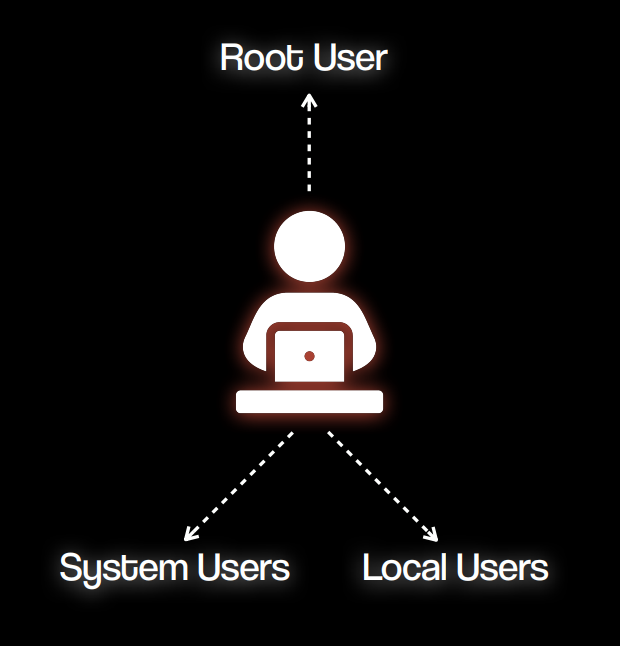

What is User Management in Linux ?

**User management in Linux** means **creating**, **modifying**, and **deleting** user accounts on the system. It includes **setting usernames**, **passwords**, and **assigning** users to **groups**. Each user can have different permissions to access files or run commands. You can also control login access and limit what a user can do. Tools like `adduser`, `usermod`, and `passwd` are used for managing users. Good user management helps keep the system secure and organized.

So in this blog, we are going to learn how to add, modify, and delete users in Linux.

We'll also cover how to manage user groups and control user access easily using basic commands.

# Types of Users in Linux



There are three types of users in Linux: **Root User**, **System User**, and **Local User**. Let’s take a look at each of them with examples.

### **Root User**

- Has all permissions and full control over the system.
- Used for administrative tasks like installing software, changing configurations, etc.
- **User ID (UID):** `0`
- **Example:** `root`

### **System User**

- Used by the system or background services (not meant for human login).
- Created automatically during OS or software installation.
- **User ID (UID) Range:** `1 - 999`
- **Examples:** `daemon`, `bin`, `syslog`, `www-data`

### **Local (Regular) User**

- Created by system administrators for real human users.
- Used for logging in and running personal tasks or applications.
- **User ID (UID) Range:** `1000 - 60000`
- **Examples:** `john`, `neha`, `student`

# Why We Should Never Use the Root User

- ✅ **It has all access**: The root user can do anything on the system, including deleting critical files—mistakes can be dangerous.
- ⚠️ **Only one ID**: Since there's only one root account, you can't track which person did what if multiple people use it.
- 🔒 **No individual accountability**: Using root directly makes it hard to keep logs of user actions for auditing or troubleshooting.
- 🔐 **Better to use `sudo`**: We give root-level permissions to specific users using `sudo`, so actions are controlled and traceable.

---

Now that we know the types of users and why we should not use the root user, let's learn how to create a user, add a user to a group, and delete users and groups with practical scenarios.

# Adding a Developer User to a Group

Suppose a new employee has joined the organization and needs to be added to the developers group.

## Creating a User

Lets create user John and see user in `/etc/passwd` and see user password in `/etc/shadow`

```bash
sudo adduser john
```

Now, lets go see user in `/etc/passwd`


Let's break it down:

Each field is separated by a colon (`:`), and the fields are:

1. **`john`** – **Username**: The login name of the user.
2. **`x`** – **Password placeholder**: The actual encrypted password is stored in `/etc/shadow`.
3. **`1002`** – **User ID (UID)**: A unique number assigned to the user.
4. **`1002`** – **Group ID (GID)**: The primary group ID for the user.
5. **`John K,,,`** – **User Info (GECOS field)**: Typically contains the full name and other optional information like office number or phone.
6. **`/home/john`** – **Home directory**: The path to the user's home directory.
7. **`/bin/bash`** – **Shell**: The login shell assigned to the user (e.g., Bash shell).

So this line says that a user named `john` exists, has UID and GID `1002`, a home directory at `/home/john`, and uses Bash as the default shell.

Now that we have seen how user is stored, lets look up how password is stored in `/etc/shadow`


Let's break it down:

Each field is separated by a colon `:`. Here's what each one means:

1. **`john`** – **Username**: The same username as in `/etc/passwd`.
2. **`$y$j9T$7DQrMgJW09.b1JtAlPjVm1$PqMm3Mr5kbIUXeZTEhLGlo/iuK8NdDCc6RZrE/.9Pp7`** – **Encrypted password**:
   - Starts with `$` and includes the hash algorithm and salt.
   - This means the password is securely hashed.
3. **`20199`** – **Last password change**: Days since Jan 1, 1970 (Unix epoch). In this case, it's the date the password was last changed.
4. **`0`** – **Minimum days between password changes**: User cannot change the password for 0 days after last change (i.e., can change it immediately).
5. **`99999`** – **Maximum days before password must be changed**: Password expires after 99999 days (basically never expires).
6. **`7`** – **Warning period**: User will be warned 7 days before the password expires.
7. **(empty)** – **Inactive period**: Number of days after password expires before account is disabled (empty means not set).
8. **(empty)** – **Account expiration date**: Days since Jan 1, 1970, when account will be disabled (empty means account doesn't expire).
9. **(empty)** – **Reserved field**: Not used.

## Create a Group

Now that we have created the user **john**, we are going to create a **developers** group.

```bash
sudo addgroup developers
```

Let’s check if the group is created by looking in the **`/etc/group`** file.


This is a line from the `/etc/group` file, and it represents a group on a Linux system.

- `developers` → This is the **group name**.
- `x` → This means the **group password** is stored in the `/etc/gshadow` file (it's usually not used).
- `1003` → This is the **Group ID (GID)**, a unique number identifying the group.
- (empty) → This section lists **group members**, but it's empty here, meaning no users are part of the group yet.

So this means a group named **developers** exists, has an ID of **1003**, but currently has no users added to it.

We can also use the `getent` command to view group details from the system.


## Add user to a group

Now that we have created the user **john** and the group **developer**, we’ll add **john** to the **developer** group.

After adding, we can verify the changes in the `/etc/group` files.

```bash
sudo usermod -aG developers john
```

- **`usermod`** – This is the command used to **modify a user account**.
- **`a`** – Stands for **append**. It adds the user to the group **without removing them from existing groups**.
- **`G developers`** – Specifies the **group** to which the user should be added. In this case, it's the `developers` group.
- **`john`** – This is the **username** of the user you are modifying.

It **adds user `john` to the `developers` group**, while keeping him in all his existing groups too.

> Without the -a flag, john would be removed from all other groups and added only to developers. So -a is very important here.

Let's check if the user is added to the `/etc/group` file.


Now that we've added "john" to the "developers" group, you can see it listed in the `/etc/group` file. The entry `developers:x:1003:john` shows that "john" is part of the group with ID 1003.

# Login to Another User

In this module, we will learn how to log in as another user on the system.

To log in as another user, you can use the `su` or `sudo` command, depending on your system configuration.


We logged in as the user `john` using the `su - john` command. After entering the password, we checked the current directory using the `pwd` command, which shows that we are now in `john`'s home directory: `/home/john`. This confirms that we have successfully switched to the `john` user's environment.

# Deleting a Developer user and a Group

Suppose a user has left the organization, and we no longer need their access on the system. In this case, we can delete the user account and also remove the group they were part of.

## Remove User from a Group

To remove a user from a group, use the `deluser username groupname` command.

```bash
sudo deluser john developers
```

Now, let's check the group file located in `/etc/group`


As you can see, the line `developers:x:1003:` no longer lists "john" after the colon. This means that "john" has been successfully removed from the "developers" group.

## Delete a Group

To delete a group from the system, use the `delgroup groupname` command.

```bash
sudo delgroup developers
```

Now, let's check the group file located in `/etc/group`


When we run `getent group developers` and get no output, it means the "developers" group has been deleted and no longer exists on the system.

## Delete a User

Similarly, we can delete a user using `userdel username` and then check the `/etc/passwd` file to confirm the user is removed.

```bash
sudo userdel -r john
```

The `-r` option in the `sudo deluser -r john` command removes the user `john` and also deletes their home directory and mail spool, ensuring that all associated files are cleaned up.

Now, let's check the `/etc/passwd` file to confirm that the entry for the user `john` has been removed.


# Conclusion

In conclusion, user management is a crucial part of maintaining a secure and organized Linux system. We explored the different types of users, why it's important to avoid using the root user for regular tasks, and how to effectively create, delete, and manage users and groups. We also learned how to add users to groups, create and delete groups, and how to switch to another user’s account using the `su` command. By following these practices, you can ensure better control and security over your Linux system.
