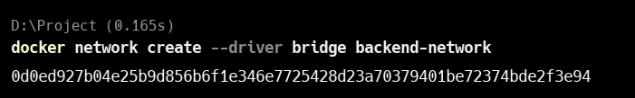

**Docker** is a tool that lets you package your app and everything it needs into a container so it runs the same everywhere.

When you're working with multiple containers—like a web app and a database—they need a way to talk to each other. That’s where **Docker networking** becomes important.

Setting up container communication safely is also critical, especially when dealing with sensitive data or external connections.

In this blog, you'll learn how Docker networks work, how to connect containers securely, and best practices for managing communication between them.

# **What Is Docker Networking?**

**Docker networking** allows containers to communicate with each other, the host machine, and the outside world. It plays a key role in how data flows between services in a containerized application.

By default, when you run a container, Docker connects it to a **bridge network**, which lets containers on the same host talk to each other using their container names as hostnames.

Docker provides several **built-in network drivers**, each designed for different use cases:

- **`bridge`** – The default driver for standalone containers. Great for local communication on a single Docker host.
- **`host`** – Removes the network isolation between the container and the host, letting the container use the host’s network directly.
- **`overlay`** – Enables communication between containers across multiple Docker hosts, often used in Docker Swarm.
- **`macvlan`** – Assigns a MAC address to a container, making it appear as a physical device on the network.
- **`none`** – Disables networking entirely for the container (used for isolation or special cases).

In this blog, we’ll focus on two of the most commonly used drivers: **bridge** and **host**. You'll learn how they work, how to use them, and when to choose one over the other.

# **Creating and Managing Docker Networks**

Docker makes it easy to create and manage networks so your containers can communicate securely and efficiently. Let’s look at how to create a custom network and why it matters.

## **Creating a Custom Bridge Network**

To create a custom network using the `bridge` driver:

```bash
docker network create --driver bridge my_custom_net

```

Lets break it down:

- **`docker network create`**
    
    This is the main Docker CLI command to create a new network.
    
- **`--driver bridge`**
    
    Specifies the **type of network driver** to use.
    
    The `bridge` driver is Docker’s default for containers on a **single host**, allowing them to communicate with each other.
    
- **`my_custom_net`**
    
    This is the **name** you’re giving to your new network. You can use any name you prefer.
    

---

## **Why Use a Custom Network?**

By default, containers are attached to Docker's **default `bridge` network**, which is shared and not isolated. This can lead to:

- Less control over which containers can talk to each other.
- Higher risk of unintended exposure.

Custom networks offer:

- **Automatic DNS-based container discovery** (use container names to connect).
- **Better isolation** — containers can only talk to others on the same custom network.
- **Fine-grained control** over communication rules (e.g., using firewall rules).

---

## **Inspecting a Docker Network**

You can inspect any network to see connected containers, subnet info, and more:

```bash
docker network inspect my_custom_net

```

This returns a JSON output showing:

- Network ID
- Driver type
- Subnet and gateway
- Connected containers and their IP addresses

This helps you debug and verify container connectivity.

# **Connecting Containers Securely**

To allow containers to talk to each other **securely and in isolation**, you should run them on a **custom user-defined Docker network** (like `my_custom_net`). This ensures that only containers on the same network can communicate.

## **Running Containers with a Custom Network**

Here’s how you can attach a container to a custom bridge network:

```bash
docker run -d --name app1 --network my_custom_net app_image

```

This command does the following:

- `d` runs the container in **detached** mode (in the background).
- `--name app1` gives your container a friendly name.
- `--network my_custom_net` connects the container to the custom bridge network.
- `app_image` is the image you’re running.

Now, if you start another container on the same network:

```bash
docker run -d --name app2 --network my_custom_net app_image

```

The two containers can securely talk to each other using their names (`app1`, `app2`) as hostnames:

```bash
# Inside app2, you can ping or connect to:
ping app1

```

# **Real-World Use Case**

Now that we’ve learned what Docker networking is, how to create a custom network, and how to run containers in it — let’s see it in action with a practical example.

Here’s the real-world scenario we’ll walk through:

1. **Create a custom Docker network** using the `bridge` driver.
2. **Run a MySQL container** on this custom network.
3. **Start an Nginx application container** on the same network, binding port `3000:3000` .
4. **Launch a monitoring container** using the `host` network driver.

## Create Custom Network



The command:

```bash
docker network create --driver bridge backend-network
```

creates a custom Docker network named `backend-network` using the `bridge` driver.

- `-driver bridge` tells Docker to use the bridge network type, which is the default for single-host communication.
- `backend-network` is the name you give to the network.
- The long string returned is the unique ID of the created network.


```bash
docker network ls
```

lists all Docker networks on your system.

In the output, you can see:

- `backend-network` is the **custom network** you created using the bridge driver.
- Other networks like `bridge`, `host`, and `none` are **default Docker networks**.

## Run MySQL in custom Network


This command runs a MySQL container using Docker with some specific settings:

```bash
docker run -d --rm --name my-sql --network backend-network -e MYSQL_ROOT_PASSWORD=root mysql
```

- `docker run`: Starts a new container
- `d`: Runs the container in the background (detached mode)
- `-rm`: Automatically removes the container when it stops
- `-network backend-network`: Connects the container to the custom Docker network (`backend-network`)
- `e MYSQL_ROOT_PASSWORD=root`: Sets the root password for MySQL to `root`
- `mysql`: Uses the official MySQL image from Docker Hub


Here we can see that `mysql` is running in detach mode.

### Inspect the network


```bash
docker network inspect backend-network
```

Here in the image you can see that `mysql` is running in custom network `backend-network` with IP of `172.18.0.2` .

## Run Nginx on custom network


```bash
docker run -d --rm --name my-nginx --network backend-network -p 3005:80 nginx

```

- `docker run`: Starts a new container
- `d`: Runs the container in the background (detached mode)
- `-rm`: Automatically removes the container when it stops
- `-name my-node`: Names the container `my-node`
- `-network backend-network`: Connects it to the custom Docker network `backend-network`
- `p 3005:3000`: Maps port 3000 inside the container to port 3005 on your host machine
- `node`: Uses the official Node.js image from Docker Hub


Here you can see that 2 containers are running : `my-nginx` and `my-sql` .

### Inspect the Network


```bash
docker network inspect backend-network
```

Here in the image you can see that container `my-nginx` and `my-sql` is running on IP `172.18.0.2` and `172.18.0.3` in custom network `backend-network` .

### Now lets ping to see if we can talk to containers in an internal network


In the above you can clearly see that we can `DNS resolve` another container within network 

- We ran:
    
    ```bash
    docker exec -it my-sql /bin/bash
    ```
    
    This opened a shell inside the `my-sql` container.
    
- Then we ping:
    
    ```bash
    ping my-nginx
    ```
    
    Since both containers are on the **same custom bridge network** (`backend-network`), Docker automatically adds internal DNS, so the name `my-nginx` resolves to its container IP (`172.18.0.3`).
    
- The ping result shows successful communication between `my-sql` and `my-nginx`, with **0% packet loss** and very low latency.

Let’s try same from `my-nginx` to `my-sql` 


## **Launch a monitoring container** using the host network driver


```bash
docker run -d --rm --name host-nginx --network host nginx
```

This command runs an Nginx container named `host-nginx` using the host’s network.

- `-name host-nginx`: Names the container for easy reference.
- `-network host`: Makes the container share the host machine’s network.
- `nginx`: Uses the official Nginx image.

### Lets Inspect the Host Network


This shows that `host-nginx` is running on `host` with no IP as it occupy IP of host. 

## This is what Docker bridge and host network look like


# **Conclusion**

Docker networking makes it easy to connect containers securely and efficiently. By using custom networks and the right network drivers like `bridge` and `host`, you can control how your containers communicate and keep your applications more secure. With just a few simple commands, you can build flexible and isolated environments for real-world apps.