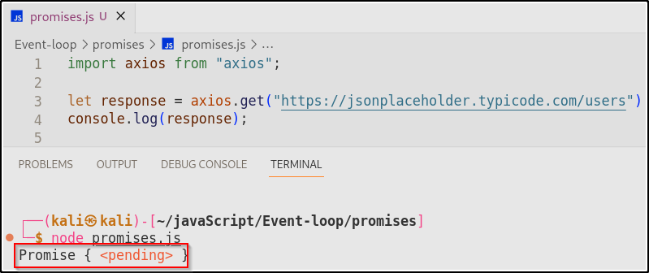
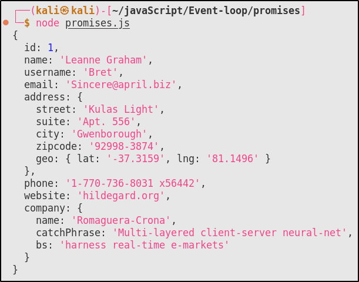
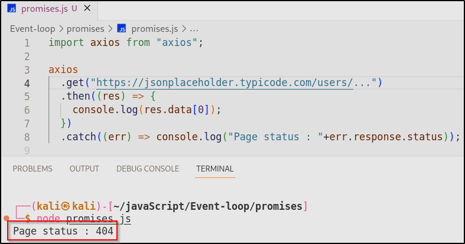

<!-- # What is asynchronous js, promises and how to consume them ? -->

JavaScript is a single-threaded language, meaning it has only one main execution thread, and code is generally executed sequentially from top to bottom. However, JavaScript has introduced the concepts of asynchronicity and the event loop to efficiently handle non-blocking operations, such as I/O operations and network requests, without freezing the entire application.

Promises are created whenever we deal with an asynchronous block of code and these have to be consumed, .then .catch and async await are 2 ways to consume a promise , ( promise chaining is also one ).

So, in this blog we are going to learn about promises and how we can consume it using `async/await`.

# What is Promises ?

Promises are objects that represent a value that may not be available yet but will be at some point in the future. They are used to handle asynchronous operations such as fetching data from a server.

Promises have three states: **pending**, **fulfilled**, and **rejected**. When a promise is fulfilled, it means that the operation was successful and the promised value is available. When a promise is rejected, it means that the operation failed and an error is thrown.

Let’s understand promises state with proper example :

## Pending state of promises

The "Pending" state of a Promise is the initial state when the Promise is created but has not yet been resolved or rejected. It represents the period when an asynchronous operation is in progress, and the Promise is waiting for that operation to complete.

Let’s understand with an example :



From above code :

1. **`import axios from "axios";`**: This line brings Axios, a tool for sending web requests, into your code.
2. **`let response = axios.get("https://jsonplaceholder.typicode.com/users");`**: This line sends a request to a web address. The result of this request, called **`response`**, is a promise - think of it like a ticket that says "I'll get the data for you."
3. **`console.log(response);`**: This logs that promise to the console, which isn't the actual data you want, but a way to get it later.

## F**ulfilled state of Promises**

The "Fulfilled" state of a Promise indicates that the asynchronous operation associated with the Promise has completed successfully, and a result (or value) is available. In other words, the Promise has done what it was supposed to do, and it now holds the outcome of that operation.

Let’s understand with an example :

```jsx
import axios from "axios";

axios
  .get("https://jsonplaceholder.typicode.com/users/")
  .then((res) => {
    console.log(res.data[0]);
  })
  .catch((err) => console.log("Page status : " + err.response.status));
```

Output :



From above code :

1. **`axios.get("https://jsonplaceholder.typicode.com/users/")`**: This line sends an HTTP GET request to the URL "[**https://jsonplaceholder.typicode.com/users/**](https://jsonplaceholder.typicode.com/users/)" using the Axios library. It initiates a request to retrieve data.
2. **`.then((res) => { console.log(res.data[0]); })`**: After the request is successful, this code handles the response (**`res`**) by logging the first user's data from the JSON response (**`res.data[0]`**) to the console. In this case, it prints the data of the first user.
3. **`.catch((err) => console.log("Page status : "+err.response.status))`**: If there's an error during the request, this code handles it by logging a message to the console. It specifically checks the **`response.status`** property of the error object to print the HTTP status code of the response. This can help identify what went wrong with the request.

## R**ejected state of Promises**

The "Rejected" state of a Promise indicates that an error has occurred during the asynchronous operation associated with the Promise. It signifies that the operation did not complete successfully, and there was some issue or failure.

Let’s understand with an example :



From above code :

1. We can see that `.then` does not execute because of `API` error.
2. Because of which execution shift to line 8 to execute the status of the page which is `Page status : 404` , which means page not found or `rejected`.

# Handling multiple Promises

Handling multiple promises in JavaScript is a common scenario, especially when dealing with asynchronous operations like fetching data from multiple sources or making multiple API calls.

Here, we are going to use **Promises chaining** to handle multiple request and we will see why it is not a right method to perform **Promises chaining.**

## Promise chaining

Promise chaining with Axios is a technique that allows you to manage a sequence of asynchronous HTTP requests in a clean and organized manner.

Axios returns Promises for HTTP requests, making it well-suited for chaining. Here's how promise chaining works with Axios:

1. **Starting with an Initial Request**: You begin with an initial Axios request that represents the first asynchronous HTTP operation in your sequence.
2. **Chaining `.then()`**: After the initial Axios request, you can chain one or more `.then()` methods. Each `.then()` method specifies what should happen when the preceding Axios request is resolved (i.e., the HTTP request is successful). You pass a callback function to `.then()` to define this behavior.
3. **Chaining `.catch()`**: You can also chain a `.catch()` method after the `.then()` methods. The `.catch()` method specifies what to do if any of the preceding Axios requests in the chain encounter an error (e.g., a network error or a non-successful HTTP status code). Like `.then()`, you pass a callback function to `.catch()` to handle errors.
4. **Returning New Promises**: In each `.then()` or `.catch()` callback, you have the option to return a new Promise, such as another Axios request. This allows you to chain additional HTTP requests or error handling logic.

Here's an example of promise chaining with Axios:

```jsx
axios
  .get("<https://api.example.com/data>")
  .then((response) => {
    if (response.status !== 200) {
      throw new Error("Request failed with status: " + response.status);
    }
    return response.data;
  })
  .then((data) => {
    // Process the data from the first request
    console.log(data);

    // Return a new Axios request
    return axios.get("<https://api.example.com/other-data>");
  })
  .then((otherDataResponse) => {
    // Process the data from the second request
    console.log(otherDataResponse.data);
  })
  .catch((error) => {
    // Handle errors that occurred in the chain
    console.error(error);
  });
```

In this example:

- The initial `axios.get` request fetches data from a remote server.
- The first `.then()` handles the response and checks if the status code is not 200 (i.e., not successful). If not, it throws an error.
- The second `.then()` processes the data from the first request and returns a new Axios request for "other-data."
- The third `.then()` processes the response from the second request.
- The `.catch()` at the end handles any errors that occurred in the chain.

## Problem with Promise chaining

Potential problems with promise chaining in JavaScript:

1. **Callback Hell**: Promise chains can become hard to read when nested deeply, leading to what's called "callback hell" or the "pyramid of doom."
2. **Error Handling**: Handling errors in long promise chains can be challenging as you need to add `.catch()` at the end, making error handling code scattered.
3. **Readability and Maintainability**: Long and complex chains can make code less readable and harder to maintain.
4. **Inflexibility**: Chains are sequential, so they might not be the best choice for independent async operations.
5. **Performance Overhead**: Each `.then()` introduces a small performance overhead in long chains.

Despite these issues, promise chaining remains a valuable tool for managing asynchronous code, and you can improve it with `async/await` and by breaking up long chains into smaller functions.

# Async/Await

`async/await` is a JavaScript feature that simplifies asynchronous code by making it look and behave more like synchronous code.

The `async/await` syntax was introduced in the ECMAScript 2017 (ES8) specification.

It's particularly useful for handling promises and making asynchronous operations easier to read and manage. `axios` is a popular library for making HTTP requests in JavaScript, and it can be used with `async/await` to create cleaner and more readable code.

Here's an example of how `async/await` is used with `axios`:

```jsx
const axios = require("axios"); // Import the Axios library

// Define an async function to make an HTTP request
async function fetchData() {
  try {
    // Use await to make the HTTP GET request
    const response = await axios.get("<https://api.example.com/data>");

    // Access the data from the response
    const data = response.data;

    // Process and work with the data
    console.log(data);
  } catch (error) {
    // Handle any errors that occurred during the request
    console.error(error);
  }
}

// Call the async function
fetchData();
```

In this code:

1. We import the Axios library using `require('axios')`.
2. We define an `async` function called `fetchData` that will make an HTTP GET request to `'<https://api.example.com/data'`>.
3. Inside the `try` block, we use `await` before the `axios.get` call. This tells JavaScript to pause execution of the function until the promise returned by `axios.get` is resolved or rejected. This makes the code look synchronous, even though it's asynchronous behind the scenes.
4. We can access the data from the response using `response.data` and then process or work with the data as needed.
5. In the `catch` block, we handle any errors that might occur during the HTTP request. This is where you can handle network issues, server errors, or any other errors related to the request.

By using `async/await` with `axios`, you can write asynchronous code in a more linear and readable way, making it easier to handle HTTP requests and manage the associated asynchronous operations.

## Handling multiple Promises with Async/Await

You can achieve promise chaining with `async/await` by using `await` to pause the execution of an asynchronous operation and then use `try/catch` blocks to handle any errors that may occur. Here's an example of promise chaining with `async/await` using Axios:

```jsx
async function fetchData() {
  try {
    // Initial Axios request
    const response1 = await axios.get("https://api.example.com/data");

    if (response1.status !== 200) {
      throw new Error("Request failed with status: " + response1.status);
    }

    const data1 = response1.data;
    console.log(data1);

    // Second Axios request
    const response2 = await axios.get("https://api.example.com/other-data");
    const data2 = response2.data;
    console.log(data2);

    // Continue with more operations if needed...
  } catch (error) {
    // Handle errors that occurred in the try block
    console.error(error);
  }
}

// Call the async function
fetchData();
```

In this `async/await` example:

- We define an `async` function called `fetchData` to manage the sequence of asynchronous operations.
- Inside the `try` block, we use `await` to pause execution and wait for the completion of each Axios request. If an error occurs, the control flows to the `catch` block.
- After the successful completion of each Axios request, we process the response data and log it.
- You can continue with more asynchronous operations as needed within the `try` block.

The `catch` block handles any errors that occurred in the `try` block, including errors thrown explicitly or those that might occur during the Axios requests.

Using `async/await` with promise chaining provides a more linear and readable way to manage sequences of asynchronous operations, making your code easier to understand and maintain.

# Conclusion

In simple terms:

- **Promise Chaining**: It's like a series of promises passing the results down the line, and you specify what happens next with **`.then()`** and **`.catch()`** methods.
- **Async/Await** : It's a cleaner and more readable way to handle those promises. It looks like regular synchronous code but still handles async operations one after the other.
